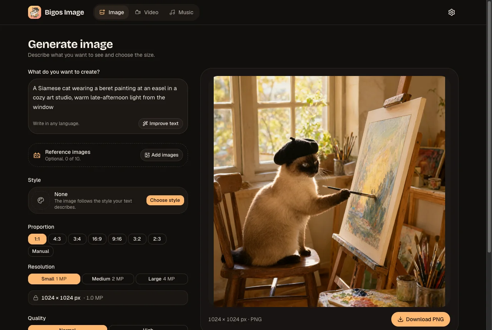
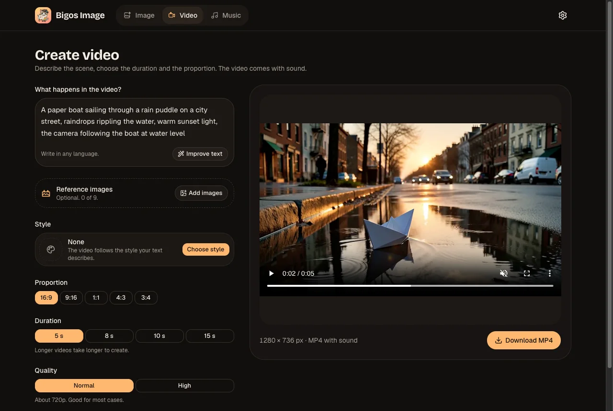
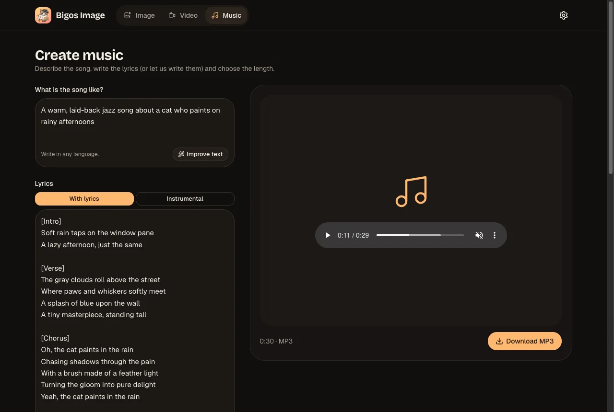
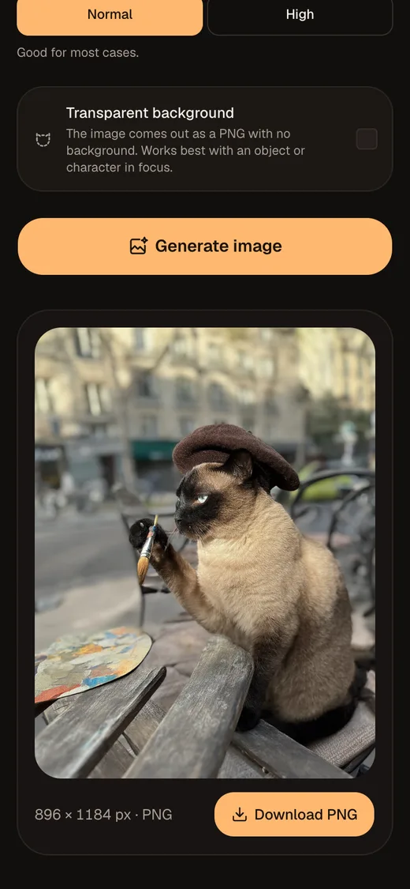
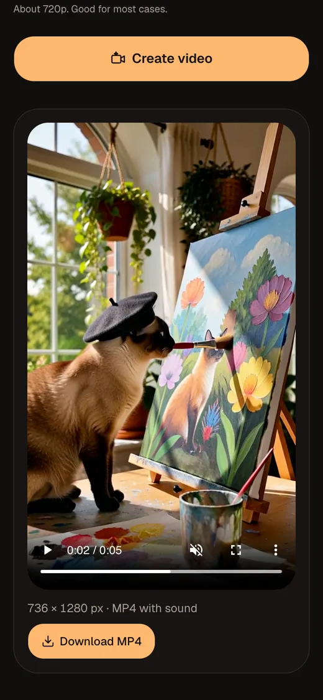
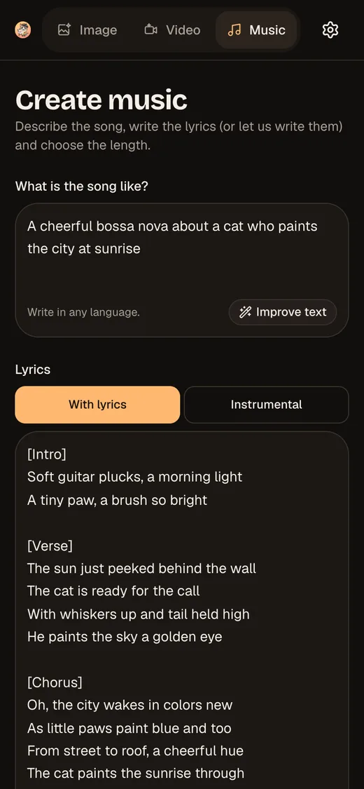

# Bigos Image

A simple image, video and music generator for people who know nothing about AI, built on **ComfyUI** with **Qwen Image 2.1** (images), **MiniMax H3** (video with sound) and **MiniMax Music 3** (songs). You describe what you want in any language, pick a few friendly options, and the app does the rest: it builds the ComfyUI graph, queues the job, shows progress and hands you a PNG, MP4 or MP3.

📱 **Made for your phone.** It installs as an app (PWA) and runs great on mobile — tested on Android, on a Samsung Galaxy S24+. See [Made for your phone](#made-for-your-phone).

| Image | Video | Music |
|:-----:|:-----:|:-----:|
|  |  |  |

## Contents

- [Made for your phone](#made-for-your-phone)
- [Features](#features)
  - [Image](#image) · [Video](#video) · [Music](#music) · [Everywhere](#everywhere)
- [How it works](#how-it-works)
- [Requirements](#requirements)
- [ComfyUI components](#comfyui-components)
  - [Image tab — Qwen Image 2.1](#image-tab--qwen-image-21)
  - [Video tab — MiniMax H3](#video-tab--minimax-h3)
  - [Music tab — MiniMax Music 3](#music-tab--minimax-music-3)
- [Running with Docker](#running-with-docker)
  - [Versions and releases](#versions-and-releases)
  - [Building the image locally](#building-the-image-locally)
- [Development](#development)
- [Project layout](#project-layout)
- [License](#license)

## Made for your phone

Bigos Image is built mobile-first and works as an **installable app (PWA)**: full screen, with its own icon and launch screen, dark or light theme, finger-sized buttons, and results you can download straight to the phone. The layout adapts to any screen, with no sideways scrolling.

**Tested on Android** — a Samsung Galaxy S24+ — with image, video and music generation.

| Image | Video | Music |
|:-----:|:-----:|:-----:|
|  |  |  |

**Install it:**

- **Android (Chrome):** open the app's address, then menu ⋮ → **Install app** (or **Add to Home screen**).
- **iPhone / iPad (Safari):** Share → **Add to Home Screen**. The app ships the iOS icons and launch screens; it has been tested less on iOS than on Android.

The PWA needs the app served over **HTTPS** (a reverse proxy in front of the Docker container, for example); `localhost` also works for trying it out.

## Features

### Image
- **Text to image**, with up to 10 **reference images** (reorder them, mention them in the text as `[Image 1]`).
- **Edit a photo** with a reference ("replace the background of [Image 1] with a beach") and pick the **Original** proportion to keep Image 1's size.
- **Size without jargon:** proportion (1:1, 4:3, 16:9…) plus resolution (Small/Medium/Large) or Manual; the backend recomputes and validates everything.
- **51 styles** (watercolor, anime, pixel art, cyberpunk…) with previews generated by the model itself.
- **Transparent background** (PNG with alpha) and **Quality** Normal/High.

### Video
- Describe the scene and choose **duration** (5, 8, 10 or 15 s), **proportion** (16:9, 9:16, 1:1, 4:3, 3:4) and **Quality** (≈720p / ≈1080p).
- The result is an **MP4 with sound**: the model generates the soundtrack together with the picture, and the app derives the sounds from your text.
- Optional **references** (up to 9: characters, places, objects) and the same 51 styles.

### Music
- Describe the song, then choose **lyrics** or **instrumental**:
  - write the lyrics yourself (they are sung exactly as written, never translated),
  - or tap **Create lyrics for me** to get lyrics in your language, split into verses and chorus, ready to edit (with undo).
- Optional **genre** (pop, rock, samba, MPB, bossa nova, sertanejo, forró, funk, electronic, hip-hop, lo-fi, reggae, jazz, classical, kids) and **length** (30 s to 3 min).
- The result is an **MP3** with its real length.

### Everywhere
- **Improve text:** an LLM expands your idea in your own language, with undo; it can be used again.
- **Automatic final step:** before ComfyUI, the text is translated to English, image references become `<imageN>`, and the style or genre goes first in the prompt, in each model's own prompt format.
- **One shared queue** with position ("2 ahead of you"), progress, cancel and retry.
- **Installable PWA** that runs great on phones (tested on Android), light and dark themes, **4 languages** (pt-BR, en-US, es-MX, zh-CN) picked from the browser.
- **GPU machine that sleeps:** if ComfyUI sits behind Wake-on-LAN, the app shows "Connecting…" and waits up to 30 s.

## How it works

```
browser ──► Next.js (pages + API) ──► queue (Redis/BullMQ) ──► worker ──► ComfyUI (GPU)
                                                             └──► LLM (optional, e.g. LiteLLM)
```

The browser only talks to the app; ComfyUI and the LLM are never exposed. The worker runs in the same process as the server and handles one generation at a time, oldest first.

Approximate times on an RTX 5060 Ti 16 GB: an image in ~20 s, a 5 s video at 720p in ~2 min, a song in about twice its length.

## Requirements

- **ComfyUI** reachable from the app, with the components listed below. Each tab only needs its own, so you can run just Image, for example.
- **Optional:** an OpenAI-compatible API (e.g. [LiteLLM](https://github.com/BerriAI/litellm)) with a small model, for "Improve text", "Create lyrics for me" and the final step (translation, references, style). Without it those buttons disappear and the prompt goes as written, with the style at the end.

## ComfyUI components

Tested with **[ComfyUI](https://github.com/Comfy-Org/ComfyUI) 0.37.0**. The graphs live in [`workflows/api/`](workflows/api/); nodes are found by title (`@…`, see [`workflows/README.md`](workflows/README.md)). Save each model in the folder shown, inside `ComfyUI/models/`.

### Image tab — Qwen Image 2.1

Nodes: all built into ComfyUI (`TextEncodeQwenImage21`, `QwenImage21Cache`, `SaveImageAdvanced`, `ComfySwitchNode`…).

| Type | File | Folder | Download |
|------|------|--------|----------|
| Diffusion | `qwen_image_2.1_int8_convrot.safetensors` | `diffusion_models/` | [Comfy-Org/Qwen-Image-2.1](https://huggingface.co/Comfy-Org/Qwen-Image-2.1/resolve/main/diffusion_models/qwen_image_2.1_int8_convrot.safetensors) |
| Text encoder | `qwen3vl_8b_int8_convrot.safetensors` | `text_encoders/` | [Comfy-Org/Qwen-Image-2.1](https://huggingface.co/Comfy-Org/Qwen-Image-2.1/resolve/main/text_encoders/qwen3vl_8b_int8_convrot.safetensors) |
| VAE | `qwen_image_2.1_vae_bf16.safetensors` | `vae/` | [Comfy-Org/Qwen-Image-2.1](https://huggingface.co/Comfy-Org/Qwen-Image-2.1/resolve/main/vae/qwen_image_2.1_vae_bf16.safetensors) |

### Video tab — MiniMax H3

Built-in nodes (`MiniMaxH3ImageToVideo`, `MiniMaxH3ReferenceToVideo`, `MiniMaxH3SigmaShift`, `SamplerCustomAdvanced`…) plus two community node packs:

| Pack | Nodes used | Repository |
|------|-----------|------------|
| KJNodes | `MiniMaxLowVRAMAttention`, `MiniMaxChunkFeedForward` | [kijai/ComfyUI-KJNodes](https://github.com/kijai/ComfyUI-KJNodes) |
| VideoHelperSuite | `VHS_VideoCombine` (MP4 with audio) | [Kosinkadink/ComfyUI-VideoHelperSuite](https://github.com/Kosinkadink/ComfyUI-VideoHelperSuite) |

| Type | File | Folder | Download |
|------|------|--------|----------|
| Diffusion (no references) | `minimax_h3_fl2va_pruned_int8_convrot.safetensors` | `diffusion_models/` | [Comfy-Org/MiniMax-H3](https://huggingface.co/Comfy-Org/MiniMax-H3/resolve/main/diffusion_models/minimax_h3_fl2va_pruned_int8_convrot.safetensors) |
| Diffusion (with references) | `minimax_h3_ref2va_pruned_int8_convrot.safetensors` | `diffusion_models/` | [Comfy-Org/MiniMax-H3](https://huggingface.co/Comfy-Org/MiniMax-H3/resolve/main/diffusion_models/minimax_h3_ref2va_pruned_int8_convrot.safetensors) |
| Text encoder | `qwen3vl_32b_minimax_h3_nvfp4_awq.safetensors` | `text_encoders/` | [Comfy-Org/MiniMax-H3](https://huggingface.co/Comfy-Org/MiniMax-H3/resolve/main/text_encoders/qwen3vl_32b_minimax_h3_nvfp4_awq.safetensors) |
| Video VAE | `minimax_h3_video_vae_int8_convrot.safetensors` | `vae/` | [Comfy-Org/MiniMax-H3](https://huggingface.co/Comfy-Org/MiniMax-H3/resolve/main/vae/minimax_h3_video_vae_int8_convrot.safetensors) |
| Audio VAE | `minimax_h3_audio_vae_fp32.safetensors` | `vae/` | [Comfy-Org/MiniMax-H3](https://huggingface.co/Comfy-Org/MiniMax-H3/resolve/main/vae/minimax_h3_audio_vae_fp32.safetensors) |
| 3-step LoRA (TaoMate) | `minimax_h3_taomate_fl2va_3step_ema_comfyui.safetensors` | `loras/` | see note below |

> **TaoMate LoRA:** it comes from [TaoLiveAIGC/TaoMate-H3](https://huggingface.co/TaoLiveAIGC/TaoMate-H3), published in PEFT format (`adapter_model.safetensors`), not in ComfyUI's. No public file has the exact name the workflow uses; it is a ComfyUI conversion. Use a ComfyUI conversion of this LoRA and save it under that name (or change `lora_name` in both `workflows/api/video_*_api.json`).

### Music tab — MiniMax Music 3

Nodes: all built into ComfyUI (`MiniMaxMusic3TextEncode`, `EmptyMiniMaxMusic3LatentAudio`, `VAEDecodeAudioTiled`, `SaveAudioAdvanced`, `SeedNode`…).

| Type | File | Folder | Download |
|------|------|--------|----------|
| Diffusion | `minimax_music3_dit_fp16.safetensors` | `diffusion_models/` | [Comfy-Org/MiniMax-Music-3](https://huggingface.co/Comfy-Org/MiniMax-Music-3/resolve/main/diffusion_models/minimax_music3_dit_fp16.safetensors) |
| Text encoder | `minimax_music3_text_encoder_pruned_int8_convrot.safetensors` | `text_encoders/` | [Comfy-Org/MiniMax-Music-3](https://huggingface.co/Comfy-Org/MiniMax-Music-3/resolve/main/text_encoders/minimax_music3_text_encoder_pruned_int8_convrot.safetensors) |
| VAE | `minimax_music3_dav.safetensors` | `vae/` | [Comfy-Org/MiniMax-Music-3](https://huggingface.co/Comfy-Org/MiniMax-Music-3/resolve/main/vae/minimax_music3_dav.safetensors) |

## Running with Docker

The image is published as `ghcr.io/wdonega/bigos-image` (x86 and ARM).

```bash
curl -O https://raw.githubusercontent.com/wdonega/bigos-image/HEAD/docker-compose.yml
COMFY_URL=http://your-comfyui:8188 docker compose up -d
```

Open `http://localhost:3000`. To turn on "Improve text", "Create lyrics for me" and the final step:

```bash
COMFY_URL=http://your-comfyui:8188 LLM_URL=https://your-litellm LLM_API_KEY=sk-... docker compose up -d
```

The variables can also live in a `.env` file next to `docker-compose.yml`.

| Variable | Required | Default | What for |
|----------|:--------:|---------|----------|
| `COMFY_URL` | yes | — | Address of ComfyUI (where the models run) |
| `LLM_URL` | no | empty | OpenAI-compatible API for "Improve text", lyrics and the final step |
| `LLM_API_KEY` | no | empty | Key for that API |
| `LLM_MODEL` | no | `prompt-enhancer` | Model name in that API |
| `PORT` | no | `3000` | Port published on the host |
| `BIGOS_IMAGE` | no | `ghcr.io/wdonega/bigos-image:latest` | Image to run (e.g. a specific version `1.0.N`) |

Every other limit (maximum size, steps per Quality, video and music time limits, retention, Wake-on-LAN wait…) has a default, listed with its value in [`.env.example`](.env.example). To change one, add it under `environment:` in `docker-compose.yml`.

Data: results and uploads in the `storage` volume (deleted after 24 h), the queue in the `redis-data` volume.

### Versions and releases

The version is **`1.0.N`**, where N is the commit's number in the history. Every push to the main branch that changes the app:

- publishes the image with three tags: **`1.0.N`**, **`revN`** and **`latest`** (the commit SHA is kept in the image label `org.opencontainers.image.revision`);
- creates the GitHub **Release `v1.0.N`** (and its git tag), with the `docker pull` command and the changes since the previous release.

To pin a version on a server: `BIGOS_IMAGE=ghcr.io/wdonega/bigos-image:1.0.33`. Documentation-only changes don't build, publish or release. Workflow: [`.github/workflows/docker.yml`](.github/workflows/docker.yml); a new version line (`1.1.N`, `2.0.N`…) is one variable there (`VERSION_PREFIX`).

### Building the image locally

```bash
docker compose -f docker-compose-dev.yml build          # builds ghcr.io/wdonega/bigos-image:latest
docker compose -f docker-compose-dev.yml up -d --build  # builds and runs it with your .env
```

## Development

Needs Node.js ≥ 24, pnpm and Docker (for Redis).

```bash
cp .env.example .env        # set COMFY_URL (and LLM_* if you have one)
pnpm install
pnpm redis                  # starts only Redis (docker-compose-dev.yml)
pnpm dev                    # http://localhost:3000
```

The queue worker is not reloaded by HMR: after changing `src/lib/jobs/worker.ts` or anything it imports, restart `pnpm dev`.

| Command | What it does |
|---------|--------------|
| `pnpm test` | unit tests (Vitest) |
| `pnpm typecheck` / `pnpm lint` | types and ESLint |
| `pnpm check:workflows` | validates `workflows/api/*.json` |
| `pnpm smoke` | one image, end to end (app running + ComfyUI) |
| `pnpm smoke:video` | one 5 s video, end to end (`--refs` uses a reference) |
| `pnpm smoke:music` | one 30 s song, end to end (`--instrumental` without lyrics) |
| `pnpm acceptance` | the spec's acceptance criteria for images (~4 min of GPU) |
| `pnpm styles:thumbs` | generates the missing style previews |
| `pnpm icons` | regenerates the favicon, PWA icons and launch screens |

Stack: Next.js 16 (App Router) + React 19, Tailwind 4 + shadcn/ui, Zod, BullMQ + Redis, sharp, Vitest.

## Project layout

```
src/app/            pages (/image, /video, /music) and API routes (/api/jobs, /api/uploads, /api/enhance, /api/lyrics, /api/health)
src/components/     UI (pickers, result panel, icons and the cat)
src/lib/            rules: sizes, prompts, styles, video, music, LLM, queue/worker, ComfyUI client
src/i18n/           texts in 4 languages (English keys)
workflows/api/      ComfyUI graphs in API format (nodes found by _meta.title)
docs/spec.md        specification and decision log (§14, in Portuguese)
```

Product details, size rules, node mapping and decisions are in [`docs/spec.md`](docs/spec.md); how to export the workflows is in [`workflows/README.md`](workflows/README.md).

## License

[AGPL-3.0](LICENSE).
