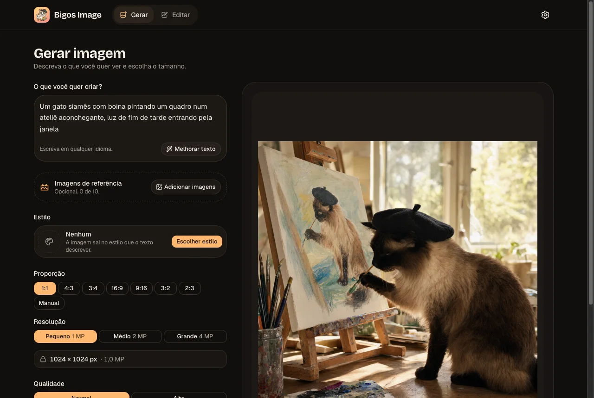

# Bigos Image

Gerador e editor de imagens simples, para quem não entende de IA, em cima do **ComfyUI** com o modelo **Qwen Image 2.1**. Você escreve o que quer (em qualquer idioma), escolhe tamanho e estilo, e o app cuida do resto: monta o grafo, fala com o ComfyUI, mostra o progresso e entrega o PNG.



## O que faz

- **Gerar:** texto para imagem, com até 10 **imagens de referência** (reordenáveis, citáveis no texto como `[Imagem 1]`).
- **Editar:** envie uma imagem e diga o que mudar; o tamanho pode seguir o original.
- **Tamanho sem jargão:** proporção (1:1, 4:3, 16:9…) + resolução (Pequeno/Médio/Grande) ou Manual; o backend recalcula e valida tudo.
- **51 estilos** (aquarela, anime, pixel art, cyberpunk…) com miniaturas geradas pelo próprio modelo.
- **Melhorar texto:** um LLM detalha a sua ideia no seu idioma, com desfazer.
- **Etapa final automática:** antes de ir ao ComfyUI, o texto é traduzido para inglês, as referências viram `<imageN>` e o estilo entra no começo do prompt.
- **Fundo transparente** (PNG com alfa), **fila** com posição e cancelamento, **Qualidade** Normal/Alta.
- **PWA** instalável, tema claro/escuro, **4 idiomas** (pt-BR, en-US, es-MX, zh-CN) escolhidos pelo navegador.
- **Máquina da GPU que dorme:** se o ComfyUI está atrás de Wake-on-LAN, o app mostra "Conectando…" e espera até 30 s.

## Como funciona

```
navegador ──► Next.js (telas + API) ──► fila (Redis/BullMQ) ──► worker ──► ComfyUI (GPU)
                                                              └──► LLM (opcional, LiteLLM)
```

O navegador fala só com o app; o ComfyUI e o LLM nunca ficam expostos. O worker roda no mesmo processo do servidor.

## Requisitos

- **ComfyUI** atualizado (usa nós novos como `TextEncodeQwenImage21` e `QwenImage21Cache`) com os modelos do Qwen Image 2.1 ([Hugging Face `Comfy-Org/Qwen-Image-2.1`](https://huggingface.co/Comfy-Org/Qwen-Image-2.1)):

  | Tipo | Arquivo | Pasta |
  |------|---------|-------|
  | Diffusion | `qwen_image_2.1_int8_convrot.safetensors` | `models/diffusion_models/` |
  | Text encoder | `qwen3vl_8b_int8_convrot.safetensors` | `models/text_encoders/` |
  | VAE | `qwen_image_2.1_vae_bf16.safetensors` | `models/vae/` |

- **Opcional:** uma API compatível com OpenAI (ex.: [LiteLLM](https://github.com/BerriAI/litellm)) com um modelo pequeno para "Melhorar texto" e para a etapa final (tradução, referências, estilo). Sem ela, o botão some e o prompt vai como foi escrito, com o estilo no fim.

## Rodando com Docker

A imagem é publicada em `ghcr.io/wdonega/bigos-image` (x86 e ARM).

```bash
curl -O https://raw.githubusercontent.com/wdonega/bigos-image/HEAD/docker-compose.yml
COMFY_URL=http://seu-comfyui:8188 docker compose up -d
```

Abra `http://localhost:3000`. Para ligar o "Melhorar texto":

```bash
COMFY_URL=http://seu-comfyui:8188 LLM_URL=https://seu-litellm LLM_API_KEY=sk-... docker compose up -d
```

As variáveis também podem ficar num arquivo `.env` ao lado do `docker-compose.yml`.

| Variável | Obrigatória | Padrão | Para quê |
|----------|:-----------:|--------|----------|
| `COMFY_URL` | sim | — | Endereço do ComfyUI (onde estão os modelos) |
| `LLM_URL` | não | vazio | API OpenAI-compatível para "Melhorar texto" e a etapa final |
| `LLM_API_KEY` | não | vazio | Chave dessa API |
| `LLM_MODEL` | não | `prompt-enhancer` | Nome do modelo nessa API |
| `PORT` | não | `3000` | Porta publicada no host |
| `BIGOS_IMAGE` | não | `ghcr.io/wdonega/bigos-image:latest` | Imagem a usar (ex.: uma revisão específica) |

Os demais limites (tamanho máximo, passos por Qualidade, retenção, tempo limite, espera do Wake-on-LAN…) têm padrão; estão listados com o valor padrão em [`.env.example`](.env.example). Para mudar algum, acrescente-o em `environment:` no `docker-compose.yml`.

Dados: resultados e uploads no volume `storage` (apagados após 24 h), fila no volume `redis-data`.

### Tags da imagem

Cada push na branch principal publica `latest` e a revisão do commit (`abc1234` e o SHA completo); tags `v1.2.3` publicam `1.2.3` e `1.2`. Mudanças só de documentação não geram imagem. Workflow: [`.github/workflows/docker.yml`](.github/workflows/docker.yml).

### Gerando a imagem localmente

```bash
docker compose -f docker-compose-dev.yml build          # gera ghcr.io/wdonega/bigos-image:latest
docker compose -f docker-compose-dev.yml up -d --build  # gera e roda com o seu .env
```

## Desenvolvimento

Precisa de Node.js ≥ 24, pnpm e Docker (para o Redis).

```bash
cp .env.example .env        # ajuste COMFY_URL (e LLM_* se tiver)
pnpm install
pnpm redis                  # sobe só o Redis (docker-compose-dev.yml)
pnpm dev                    # http://localhost:3000
```

O worker da fila não é recarregado pelo HMR: depois de mexer em `src/lib/jobs/worker.ts` ou no que ele importa, reinicie o `pnpm dev`.

| Comando | O que faz |
|---------|-----------|
| `pnpm test` | testes unitários (Vitest) |
| `pnpm typecheck` / `pnpm lint` | tipos e ESLint |
| `pnpm check:workflows` | valida `workflows/api/*.json` |
| `pnpm smoke` | 1 geração de ponta a ponta (app rodando + ComfyUI) |
| `pnpm acceptance` | critérios de aceite da spec (~4 min de GPU) |
| `pnpm styles:thumbs` | gera as miniaturas dos estilos que faltam |
| `pnpm icons` | regera favicon, ícones do PWA e telas de abertura |

Stack: Next.js 16 (App Router) + React 19, Tailwind 4 + shadcn/ui, Zod, BullMQ + Redis, sharp, Vitest.

## Estrutura

```
src/app/            telas (/generate, /edit) e rotas de API (/api/jobs, /api/uploads, /api/enhance, /api/health)
src/components/     interface (seletores, painel de resultado, ícones e o gato)
src/lib/            regras: tamanho, prompt, estilos, LLM, fila/worker, cliente do ComfyUI
src/i18n/           textos dos 4 idiomas (chaves em inglês)
workflows/api/      grafos do ComfyUI em API format (nós achados por _meta.title)
docs/spec.md        especificação e registro de decisões (§14)
```

Detalhes de produto, regras de tamanho, mapeamento dos nós e decisões estão em [`docs/spec.md`](docs/spec.md); como exportar os workflows em [`workflows/README.md`](workflows/README.md).

## Licença

[AGPL-3.0](LICENSE).
